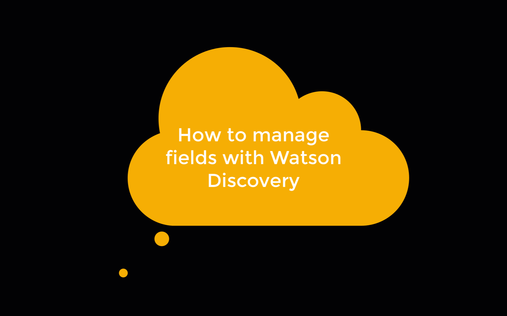

This tutorial provides step-by-step instructions on using IBM&reg; Watson&trade; Discovery, an AI search technology that uses innovations in natural language processing, machine learning, and anomaly detection to enable you to index business documents and surface answers faster and more accurately.

The tutorial uses a sample insurance document, ingests it, and then uses the built-in annotation tool in Watson Discovery to train Watson on the different sections of a particular business document. This way, you can break up the document, omit certain sections, and improve the query accuracy. Combined with a chatbot, you can use Watson Discovery to answer complex questions that previously needed a human operator to answer. This complex question-answering system not only lessens a team's workload, but can also improve a customer's experience by providing answers quickly and without a wait time that a normal phone call might entail.

The goal of this tutorial is to ingest the document, query Watson, and receive answers about the following questions directly from the document. We want to answer:

* Does my insurance cover glass repairs?

    

* Does my insurance cover medical expenses?

    

* Does my insurance cover damage to my vehicle?

    

The tutorial is divided into four major steps.

1. Create an IBM Cloud account and a Watson Discovery instance.
1. Create a collection, and upload the document to Watson Discovery.
1. Train Watson Discovery on the use case. In this example, I train it on an insurance business that will answer questions about a customer's insurance policy and what is covered under that policy.
1. Test the model by asking questions in natural language.

After completing the tutorial, you'll understand how to use Watson Discovery to quickly annotate, analyze, and answer complex questions based on the documents that you use to feed and train Watson. You'll also understand how to improve the accuracy by using relevancy training, and learn how you can extract useful information such as keywords, locations, entities, and sentiment analysis from your documents.

First, you must create an [IBM Cloud account](https://cloud.ibm.com/registration?cm_sp=ibmdev-_-developer-tutorials-_-cloudreg). For this tutorial, you do not need a credit card, and your IBM Cloud account and Watson Discovery service are free.

The following screen recordings show you how to create your Watson Discovery instance and how to use the application interface to upload, enrich, and query your data.

## Create your Watson Discovery Service instance

1. Log in to your IBM Cloud account. After you are logged in, you're taken to the `cloud.ibm.com` page.
1. Search for **Discovery** in the top search bar, and under **Catalog Results**, click **Discovery**.
1. From the Watson Discovery page, enter a name, and choose the pricing tier and location of your service.
1. Choose the lite tier (the free tier), then choose whichever location you want. Give your service a name that helps you easily identify it. I named mine `Discovery-zz`.
1. Click **Create**.

    

1. Go back to the `cloud.ibm.com` page by clicking **IBM Cloud** at the upper-left of your screen.

1. Click **Services** under **Dashboard**, then **Resource Summary**. This takes you to `cloud.ibm.com/resources`.

1. Under **Resource List > Services**, you'll see your Watson Discovery instance with the name you gave it in the previous steps. Click that instance. This takes you to your instance within IBM Cloud. There, you can see your API key as well as other details.

1. Click **Launch Watson Discovery**.

    You are taken to the Watson Discovery service home page, where you can manage your data. This is where you upload the document and data that you want to analyze.

    

## Upload your data  

1. From within the main page of Watson Discovery, click **Upload your own data**.

1. Click the sample-insurance.docx file, which is a sample insurance file you'll use to train Watson Discovery. It's located at [https://github.com/IBM/virtual-insurance-assistant/blob/master/data/discovery/sample-insurance.docx](https://github.com/IBM/virtual-insurance-assistant/blob/master/data/discovery/sample-insurance.docx).

1. After the document upload is complete, you'll see one document in the overview tab at the upper-left. You should see some sentiment analysis, entity extraction, and concept tagging, which is performed as you upload your document.

    

## Use smart document understanding to annotate your document

1. From the Watson Discovery overview page, click **Configure data**.

1. This takes you to the Smart Document Understanding annotation tool. The right pane shows the labels that you can use to label your document. Note that to create custom labels, you must upgrade to the paid version of Watson Discovery.

1. Click the paper icon (next to the magnifying glass). That takes you to the single-page view. Next, I use the `Title` field to label the title, that is, `Section 1`, and the `subtitle` field to highlight the subtitles on the page, that is, the sentence under the title. After you're done, click **Submit page**.

    You're doing this so that later on when you ask Watson Discovery about your coverage of glass or medical expenses Watson Discovery can answer directly with this text from the document.

    

    You'll notice in the lower-left corner `Viewing: Live predictions of lastest ML-model`. This means that each time you submit a page, you are training Watson Discovery on what the format of the document is. You should see that by page 4, Watson Discovery automatically starts recognizing the big section headings as `Title` fields, and then the sentence under the title as a `subtitle`, which is correct. All you have to do in that case is click `Submit`. 

    Because you are telling Watson the correct fields in a document, you are doing supervised machine learning. You are supervising Watson Discovery in the learning process.

1. Repeat this process until you reach the last page (page 5).

## Manage the fields in your document

1. After you've annotated all of the pages, click **Manage fields**.

1. Click **Split document on each occurrence of**, and select **subtitle** so that the document is split by subtitle.

1. Click **Apply changes to collection**, and add in the same `sample-insurance.docx` file that you uploaded.

After your upload is complete, you are taken to the overview page. Refresh your browser to see that Watson Discovery is splitting the documents. After Watson Discovery finishes, you should have over 10 documents. This is because you have split the original document into multiple, smaller documents based on the subtitle. This makes retrieving the answer to a particular question much easier for Watson Discovery, and enables you to get more accurate enrichments such as sentiment analysis.

## Query Watson in natural language

One of the main benefits of Watson is its ability to answer questions from your document in natural language. Before you do this, you must configure Watson to answer directly with the text that it has analyzed from the insurance document.

1. Click the magnifying glass icon in the sidebar. Then, click **More options**.

1. Under **Passages**, select **No** for **Include relevant passages**.

1. Under **Documents** for **Fields to return**, select **text**.

1. For **Number of documents to return**, select **3**.

1. Scroll to the top of the page, and under **Search for documents**, ensure that **Use natural language** is selected. Then, ask Watson the following question: "Does my insurance cover glass repairs?" Click **Run query**.

1. After the answer is returned, Summary is selected. Click **JSON**.

You should see that Watson pulls out the relevant text from the document that says the insurance company will pay for replacement or repair of the glass in your vehicle's windscreen, sunroof, or windows if the vehicle is lost or damaged.

Next, repeat the process for "Does my coverage include medical expenses?" and "Does my insurance cover damage to my vehicle?"

You should see that the relevant text from the sample insurance document is retrieved. This JSON can be used directly in your chatbot application so that Watson can answer more complex questions based on your training material.

## Integrating Watson Discovery into your application

Now that you understand how to use Watson Discovery, you might want to use this within your own application. One common pattern is to use a chatbot, and then trigger the chatbot to search for answers using a webhook. Additionally, if you want to use the natural language processing capabilities that come with Watson Discovery, you should check out the examples of using the [Watson Node SDK](https://github.com/watson-developer-cloud/node-sdk) or [any other Watson SDK](https://github.com/watson-developer-cloud).

As you can see, Watson Discovery provides built-in sentiment analysis, entity extraction, concept tagging, and other enrichments that you can choose when you click **Configure data**. Watson Discovery is based on the requirement of learning with less. You saw that within 4 or 5 pages of training, Watson Discovery was able to pick up the subtitles and text easily from the document.

This tutorial is part of the [Build a customer care](https://developer.ibm.com/articles/insurance-industry-customer-care-solution) solution to help your customers manage their insurance claims and get automobile service information.
