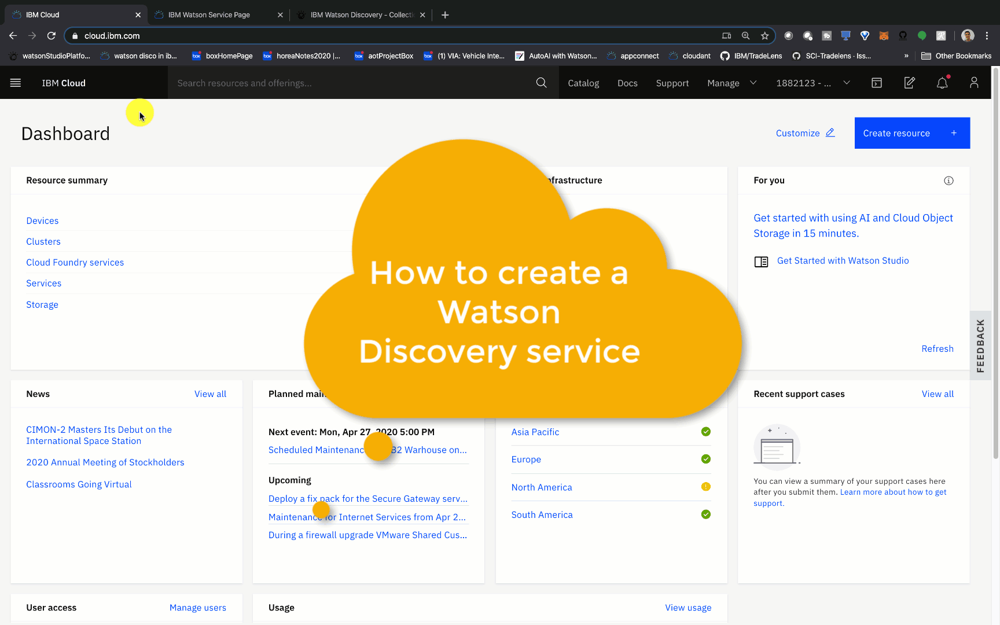
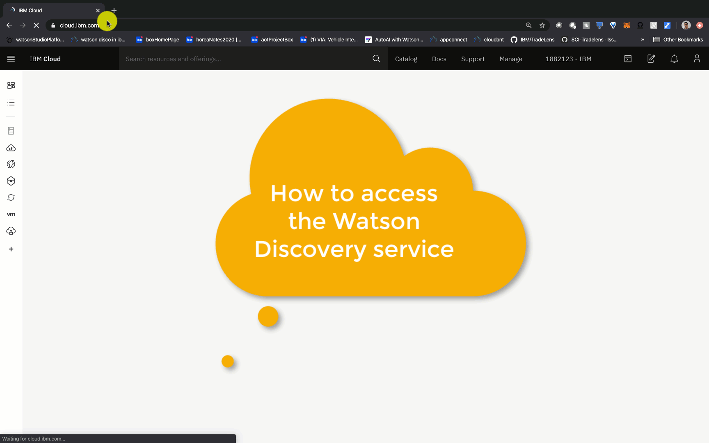
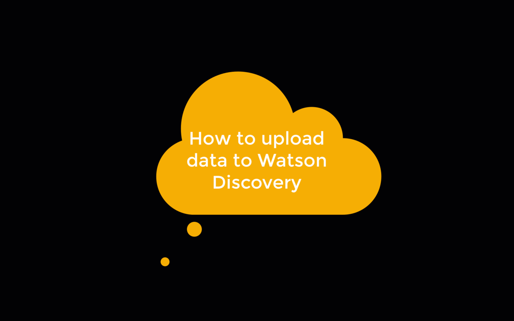
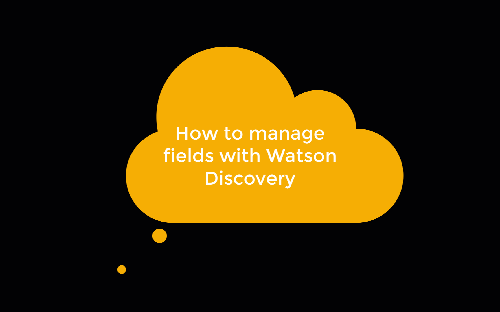

---
# 相关发布刊物：https://github.ibm.com/IBMCode/Code-Tutorials/issues/3890

abstract: "使用 Watson Discovery 和自然语言处理可以比以往更快、更准确地对业务文档建立索引并揭示答案。"

authors:
  - name: "Horea Porutiu"
    email: "Horea.Porutiu@ibm.com"

completed_date: "2020-07-28"

components:
  - "watson-discovery"

draft: false

excerpt: "使用 Watson Discovery 和自然语言处理可以比以往更快、更准确地对业务文档建立索引并揭示答案。"

last_updated: "2020-07-28"

meta_description: "使用 Watson Discovery 和自然语言处理可以比以往更快、更准确地对业务文档建立索引并揭示答案。"

meta_keywords: "artificial intelligence, smart document understanding, 人工智能"

meta_title:  "通过 Smart Document Understanding 来处理、理解和回答保单问题"

primary_tag: "artificial-intelligence"

related_content:
  - type: series
    slug: learning-path-get-started-with-natural-language-processing
  - type: series
    slug: learning-path-watson-discovery
  - type: patterns
    slug: improve-discovery-results-using-programmatic-relevancy-training

subtitle: "比以往更快、更准确地对业务文档建立索引并揭示答案"

tags:
  - "machine-learning"
  - "natural-language-processing"
  - "automotive"

title: "通过 Smart Document Understanding 来处理、理解和回答保单问题"

type: tutorial

---

本教程将提供有关使用 IBM&reg; Watson&trade; Discovery 的分步指导，这是一种 AI 搜索技术，它利用自然语言处理、机器学习和异常检测方面的创新来使您能够更快、更准确地对业务文档建立索引并揭示答案。

本教程将使用一个样本保险文件，提取其中的内容，然后通过 Watson Discovery 中内置的注解工具以使用特定业务文档的不同部分来训练 Watson。这样，您就可以分解文档，省略其中的某些部分并提高查询准确性。结合使用 Watson Discovery 和聊天机器人，可以回答以前需要人工接线员才能回答的复杂问题。这种复杂的问答系统不仅减轻了团队的工作量，而且还能快速提供答案，而无需等待正常电话呼叫可能产生的等待时间，从而改善了客户体验。

本教程的目的是提取文档，询问 Watson，并直接从文档中获取以下问题的答案。我们需要回答以下问题：

* 我的保险涵盖玻璃维修吗？

    

* 我的保险涵盖医疗费用吗？

    

* 我的保险涵盖车辆损坏吗？

    

本教程分为四个主要步骤。

1. 创建一个 IBM Cloud 帐户和一个 Watson Discovery 实例。
1. 创建一个集合，然后将文档上传到 Watson Discovery。
1. 使用用例训练 Watson Discovery。在此示例中，我使用一家保险公司的数据训练了 Watson Discovery，使其可以回答有关客户保单以及该保单涵盖范围的问题。
1. 通过用自然语言提问来测试模型。

完成本教程后，您将了解如何使用 Watson Discovery 来根据用于馈入和训练 Watson 的文档快速注释、分析和回答复杂问题。您还将了解如何通过使用相关性训练来提高准确性，并了解如何从文档中提取有用的信息（例如关键字、位置、实体和情绪分析）。

首先，必须创建一个 [IBM Cloud 帐户](https://cocl.us/IBM_CLOUD_GCG)。在本教程中，您不需要使用信用卡，并且您的 IBM Cloud 帐户和 Watson Discovery 服务都是免费的。

以下屏幕录像显示了如何创建 Watson Discovery 实例以及如何使用应用程序界面来上传、扩充和查询数据。

## 创建 Watson Discovery 服务实例

1. 登录到您的 IBM Cloud 帐户。登录后，将转到 `cloud.ibm.com` 页面。
1. 在顶部搜索栏中搜索 **Discovery**，然后在 **Catalog Results** 下单击 **Discovery**。
1. 在 Watson Discovery 页面上，输入名称，然后选择服务的定价级别和位置。
1. 选择 Lite 级别（免费级别），然后选择所需的位置。为该服务指定一个易于识别的名称。我指定的名称为 `Discovery-zz`。
1. 单击 **Create**。

    

1. 通过单击屏幕左上角的 **IBM Cloud** 以返回到 `cloud.ibm.com` 页面。

1. 在 **Dashboard** 下单击 **Services**，然后单击 **Resource Summary**。这会转到 `cloud.ibm.com/resources`。

1. 在 **Resource List > Services** 下，您将看到该 Watson Discovery 实例以及您在先前步骤中指定的名称。单击该实例。这会在 IBM Cloud 中转到该实例。在这里，您可以看到 API 密钥以及其他详细信息。

1. 单击 **Launch Watson Discovery**。

    这会转到 Watson Discovery 服务主页，您可以在其中管理数据。您还可以在其中上传要分析的文档和数据。

    

## 上传数据  

1. 从 Watson Discovery 的主页中，单击 **Upload your own data**。

1. 单击 sample-insurance.docx 文件，这是要用于训练 Watson Discovery 的样本保险文件。这个文件位于 [https://github.com/IBM/virtual-insurance-assistant/blob/master/data/discovery/sample-insurance.docx](https://github.com/IBM/virtual-insurance-assistant/blob/master/data/discovery/sample-insurance.docx)。

1. 上传完该文档后，您会在左上角的 Overview 选项卡中看到一个文档。您应该会看到情绪分析、实体提取和概念标记功能，这些功能是在您上传文档期间执行的。

    

## 使用 Smart Document Understanding 为文档添加注释

1. 从 Watson Discovery 的 Overview 页面中，单击 **Configure data**。

1. 这会转到 Smart Document Understanding 注解工具。右侧窗格显示可用于标记文档的标签。请注意，要创建自定义标签，您必须升级到 Watson Discovery 的付费版本。

1. 单击纸张图标（在放大镜旁边）。这会转到单页视图。接下来，我使用 `Title` 字段来标记标题（即 `Section 1`），并使用 `subtitle` 字段突出显示页面上的副标题（即标题下的句子）。完成后，单击 **Submit page**。

    这样做是为了在以后向 Watson Discovery 询问保险是否涵盖玻璃或医疗费用时，Watson Discovery 可以直接使用文档中的此文本进行回答。

    

    您会发现左下角显示 `Viewing: Live predictions of lastest ML-model`。这意味着，每次提交页面时，您都是在使用文档格式训练 Watson Discovery。您应该会看到，对于第 4 页，Watson Discovery 自动开始将字体较大的节标题识别为 `Title` 字段，然后将标题下的句子识别为 `subtitle`，这样做是正确的。在这种情况下，您只需单击 `Submit` 即可。 

    由于您要向 Watson 传达文档中正确的字段，因此您正在进行有监督的机器学习。在学习过程中，您需要监督 Watson Discovery。

1. 重复此过程，直至到达最后一页（第 5 页）。

## 管理文档中的字段

1. 在为所有页面添加注释后，单击 **Manage fields**。

1. 单击 **Split document on each occurrence of**，然后选择 **subtitle**，以便按副标题拆分文档。

1. 单击 **Apply changes to collection**，然后将更改内容添加到您上传的 `sample-insurance.docx` 文件中。

完成上传操作后，将转到 Overview 页面。刷新浏览器，可以看到 Watson Discovery 正在拆分文档。Watson Discovery 完成操作后，您应该有 10 多个文档。这是因为您已根据副标题将原始文档拆分为多个较小的文档。这使 Watson Discovery 可以更容易地检索特定问题的答案，并使您能够实现更准确的扩充，例如情绪分析。

## 用自然语言询问 Watson

Watson 的主要优点之一是能够用自然语言回答文档中的问题。在执行此操作之前，必须将 Watson 配置为直接使用从保险文件中分析出的文本来回答问题。

1. 单击侧边栏中的放大镜图标。然后单击 **More options**。

1. 在 **Passages** 下，针对 **Include relevant passages** 选择 **No**。

1. 在 **Fields to return** 的 **Documents** 下，选择 **text**。

1. 针对 **Number of documents to return** 选择 **3**。

1. 滚动到页面顶部，然后在 **Search for documents** 下，确保已选中 **Use natural language**。然后，向 Watson 询问以下问题：“Does my insurance cover glass repairs?（我的保险涵盖玻璃维修吗？）"单击 **Run query**。

1. 返回答案后，Summary 处于选中状态。单击 **JSON**。

您应该会看到 Watson 从文档中提取相关文本，内容大概是，如果车辆丢失或损坏，保险公司将支付更换或修理车辆的挡风玻璃、天窗或窗户上的玻璃的费用。

接下来，针对“Does my insurance cover medical expenses?（我的保险涵盖医疗费用吗？）”和“Does my insurance cover damage to my vehicle?（我的保险涵盖车辆损坏吗？）”重复以上过程。

您应该会看到已从样本保险文件中检索到相关文本。可以在您的聊天机器人应用程序中直接使用此 JSON，以便 Watson 可以根据您的训练材料回答更复杂的问题。

## 在应用程序中集成 Watson Discovery

现在，您已经了解了如何使用 Watson Discovery，您可能希望在自己的应用程序中使用 Watson Discovery。一种常见的模式是使用聊天机器人，然后使用 Webhook 触发聊天机器人搜索答案。此外，如果您想使用 Watson Discovery 随附的自然语言处理功能，请查看使用 [Watson Node SDK](https://github.com/watson-developer-cloud/node-sdk) 或[任何其他 Watson SDK](https://github.com/watson-developer-cloud) 的示例。

如您所见，Watson Discovery 提供了内置的情绪分析、实体提取、概念标记以及其他丰富的功能，您可以在单击 **Configure data** 时选择这些功能。Watson Discovery 的基本要求是“Learning With Less”（简化学习）。您已经看到在 4 到 5 页的训练材料中，Watson Discovery 能够轻松地从文档中提取副标题和文本。

本教程是[构建客户服务](https://developer.ibm.com/zh/articles/insurance-industry-customer-care-solution)解决方案的一部分，可帮助客户管理保险索赔并获取汽车服务信息。

本文翻译自：[Process, understand, and answer policy questions with smart document understanding](https://developer.ibm.com/tutorials/analyze-and-answer-policy-questions-with-smart-document-understanding/)（2020-05-21）
