---
# 相关发布刊物：https://github.ibm.com/IBMCode/Code-Tutorials/issues/4022
draft: false
title: "使用 Watson Natural Language Understanding 构建推荐引擎"
subtitle: "使用 Watson Knowledge Studio 为特定领域创建自定义的语言分析模型"
meta_title: "使用 Watson Natural Language Understanding 构建推荐引擎"
authors:
  - name: "Kalonji Bankole"
    email: "kkbankol@us.ibm.com"
  - name: "Mark Sturdevant"
    email: "mark.sturdevant@ibm.com"

completed_date: "2020-07-28"
last_updated: "2020-07-28"
excerpt: "使用 Watson Knowledge Studio 为特定领域创建自定义的语言分析模型"
meta_description: "使用 Watson Knowledge Studio 为特定领域创建自定义的语言分析模型"
meta_keywords: "natural language processing, artificial intelligence, 自然语言处理, 人工智能"
primary_tag: "artificial-intelligence"
tags:
  - "machine-learning"
  - "natural-language-processing"
components:
  - "watson-apis"
related_content:
  - type: patterns
    slug: build-a-virtual-insurance-assistant-to-process-insurance-claims
  - type: series
    slug: introduction-to-watson-natural-language-processing
  - type: tutorials
    slug: analyze-and-answer-policy-questions-with-smart-document-understanding

---

IBM&reg; Watson&trade; Knowledge Studio 是一项可为特定领域创建自定义语言分析模型的服务。这对于具有复杂用语的专业性较强的行业（如医学、法律和金融）特别有用。

在本教程中，您将了解如何使用 Watson Knowledge Studio 来为客户对汽车修理厂的评论添加注释。在为评论添加注释后，您可以训练一个机器学习模型来用于分析评论。此模型可以确定车辆需要哪种类型的维修，以及客户对工作质量的满意程度。通过分析与给定汽车修理厂相关的评论，可以生成有关该修理厂整体绩效的洞察，从而确定他们最擅长（和最不擅长）的维修类型。

## 前提条件

要遵循本教程，您需要一个 IBM Cloud 帐户。如果您还没有该帐户，则可以[创建一个](https://cocl.us/IBM_CLOUD_GCG)。

### 配置 Watson Natural Language Understanding 实例

在您获得 IBM Cloud 帐户后，导航到 [IBM Cloud 控制台](https://cloud.ibm.com?cm_sp=ibmdev-_-developer-tutorials-_-cloudreg)。

1. 单击 **Catalog**。
1. 搜索 **Natural Language Understanding**，然后单击所出现的图标。

    

1. 为 Watson Natural Language Understanding 服务选择一个定价套餐，然后单击 **Create**。

    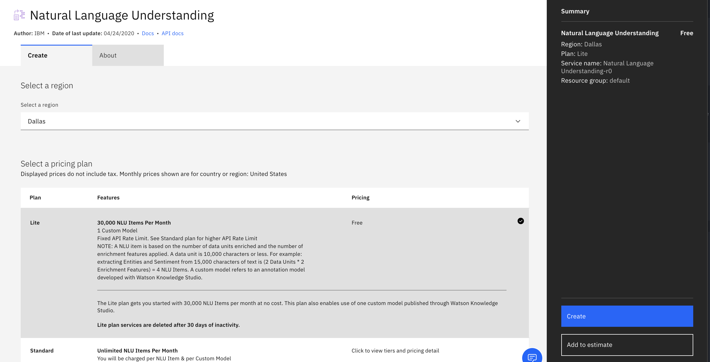

在配置该服务后，存储 API 密钥和 URL。在本教程的后面部分中将需要使用这些凭证。

### 配置 Watson Knowledge Studio 实例

要配置 IBM Watson Knowledge Studio 实例，请执行以下操作：

1. 单击 **Catalog**。
1. 搜索 **Knowledge Studio**，然后单击所出现的图标。

    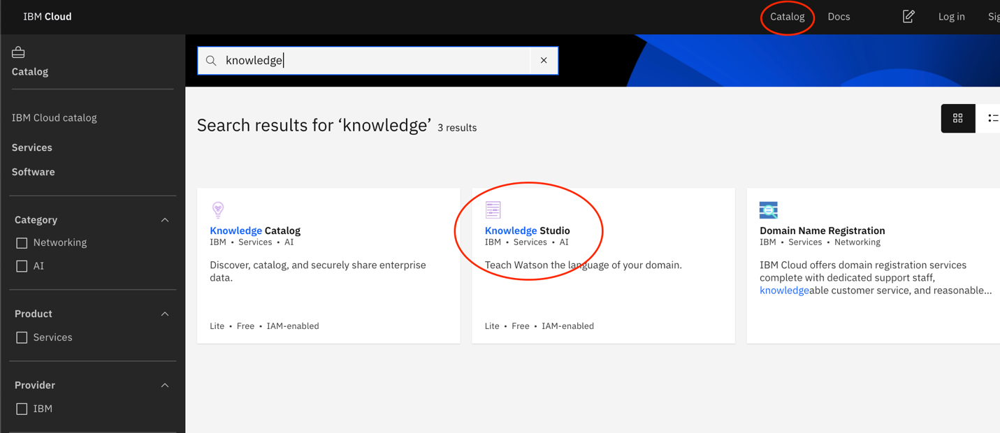

1. 选择一个定价套餐（在这里选择“Lite”就足够了），然后单击 **Create**。

    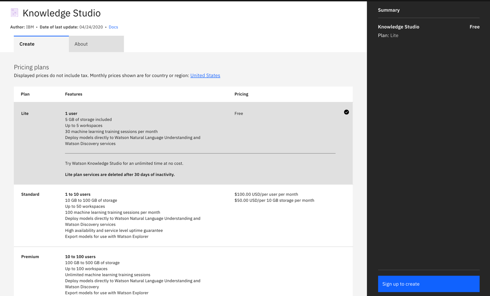

1. 在配置该服务后，单击 **Launch Watson Knowledge Studio**。

    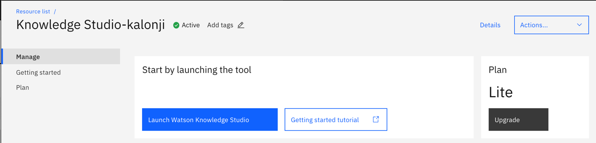

## 预估时间

在满足了前提条件之后，完成本教程大约需要 60 分钟。

## 步骤

1. [定义实体类型和子类型](#5)
2. [创建“关系类型”](#6)
3. [收集用于描述领域用语的文档](#7)
4. [为文档添加注释](#8)
5. [生成机器学习模型](#9)
6. [将模型部署到 Natural Language Understanding 服务](#-watson-natural-language-understanding)

### 定义实体和实体子类型

首先创建实体类型。实体是对象或概念的一种表示形式。在此例中，您将创建几个与汽车修理相关的实体，例如 *Mechanic*、*Vehicle* 和 *Repair*。首先，您将创建一个 *Repair* 实体，该实体描述了导致车辆需要修理的问题。

1. 单击左侧菜单中的 **Entity Types**。

1. 单击 **Add Entity Type**。

    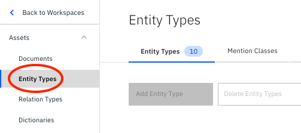

1. 将新实体标记为 *Repair*。

1. 添加子类型，以便进一步对实体实例进行分类。例如，对交流发电机或火花塞的引用可以标记为 *Repair* 实体的 *Electrical* 子类型。

    

现在您已经了解了如何创建实体，接下来可以上载预配置的实体类型列表。下载 [JSON 类型](https://github.com/IBM/virtual-insurance-assistant/blob/master/data/wks/types-8c501370-8411-11ea-9a22-cf86d29dec48.json)，然后单击 **Upload**。


在上载并创建实体类型后，单击 **Save**。

### 创建关系类型

关系类型描述了两个实体之间的关联方式。例如，如果您具有 *Vehicle*、*Customer* 和 *Mechanic*，则车辆可能与客户存在 *OwnedBy* 关系，并与修理技师存在 *RepairedBy* 关系。

1. 通过单击菜单中的 **Relation Types** 来创建关系。

1. 单击 **Add Relation Types**。

1. 为该关系类型命名，并列出可存在该关系的有效实体对。

    在上一步中应该已上载了一组关系类型。此例中的示例包括：

    * RepairedBy（*Vehicle* 可以被 *Mechanic* 修理）
    * OwnedBy（*Vehicle* 可以被 *Driver* 拥有）
    * DamagedBy (*Vehicle* 可以被 *Driver* 或 *Mechanic* 损坏）

    

### 收集用于描述领域用语的文档

收集包含用于描述汽车损坏和维修的文本示例的文件。Watson Knowledge Studio 可通过这些示例来学习相关的*领域用语*，包括汽车修理技师常用的术语和短语。在此示例中，我们使用了用于描述客户对各个修理技师的评价的客户评论。

我们提供了一组预先注解的综合评论作为起点，您可以[下载](https://github.com/IBM/virtual-insurance-assistant/blob/master/data/wks/corpus-e6e25540-9c54-11ea-b92e-afac3e68cacf.zip)这些评论。

如果想要使用一些实际的调查数据来训练数据模型，则可以使用 [Yelp 数据集](https://www.kaggle.com/c/yelp-recruiting/data)，您可以根据 Yelp 使用条款来访问此数据集。该数据集包含一个 JSON 文件，其中包括关于美国各地汽车修理厂的数百万条评论。必须将每条评论放入单独的 .txt 文件中。

在收集文档后，需要将它们上载到 Watson Knowledge Studio 中。登录到 Watson Knowledge Studio 实例，然后单击 **Documents**。

1. 单击 **Upload Document Sets**。

    

1. 将文档拖到 **Add a Document Set** 部分中，以上载这些文档。

    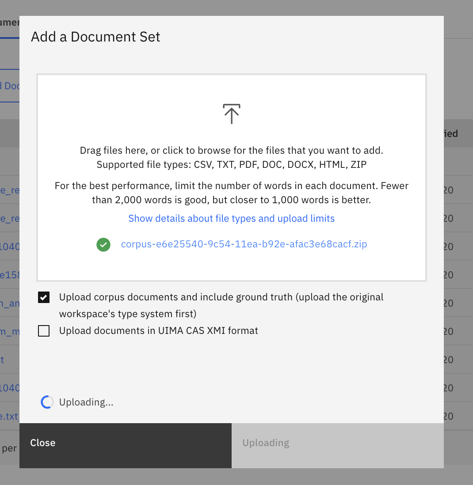

### 为文档添加注释

在创建实体和关系类型后，您可以添加注释，以便将每个文档的词语和短语映射到您定义的实体。

1. 单击 **Machine Learning Model**，然后单击 **Annotations**。

    

1. 找到您先前上载的文档集，然后单击 **Annotate**。

    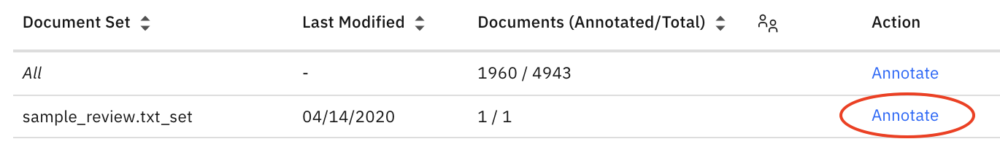

1. 通过选择每个相关词语或短语，开始为文档中引用了某个已定义实体的所有提及添加注释。

1. 单击右侧菜单中对应的实体类型。

    我们在图像中应用以下注释。

    * *SUVs* 和 *Motorcycles* 可以标记为 *Vehicle* 和子实体 *Type*。
    * *Glass Repair* 和 *Body Work* 可以标记为 *Repair* 实体和 *Glass* / *Body* 子类型。
    * *Joe's Auto Repair*、*Joe*、*Lydia* 和 *they* 指的是修理技师。

    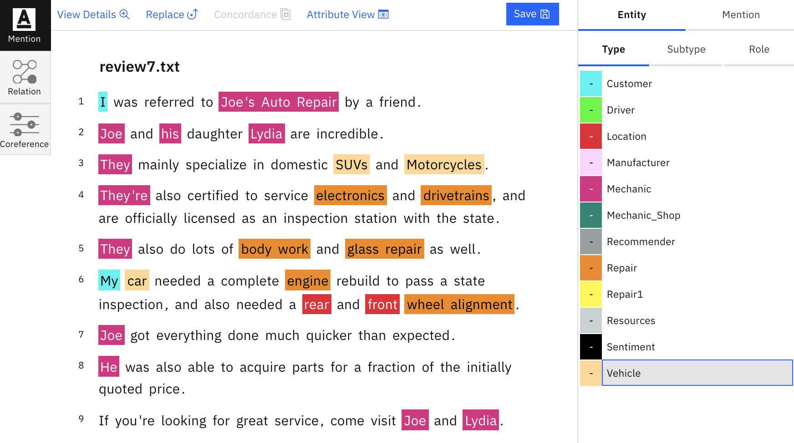

1. 通过单击 **Relation**（在下图中显示为黑色）来定义实体之间的关系。

    在此示例中，*My* 是对客户或评论者的引用。*Car* 由客户拥有，因此它被标记为 *Vehicle* 实体，并且与客户存在 *belongsTo* 关系。提及 *suspension* 具有 *Repair* 实体，并且与车辆存在 *needsRepairType* 关系。

    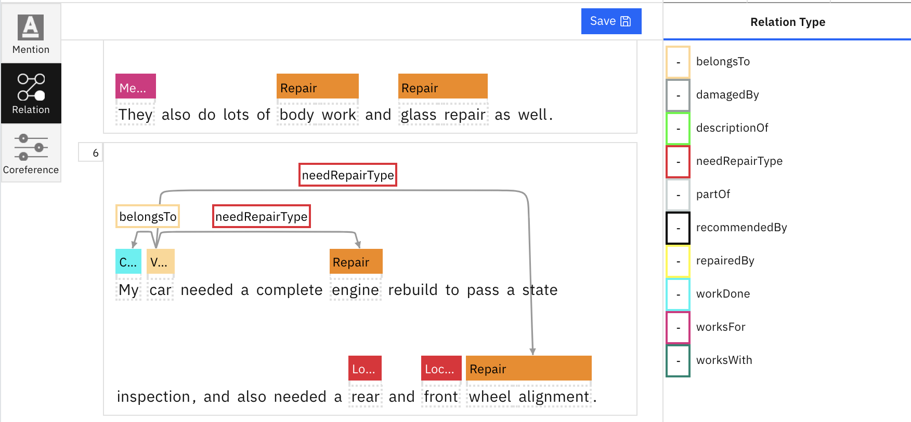

1. 添加共同引用，当有多个不同提及引用了同一实体时便会发生共同引用。在此例中，*Joe*、*his* 和 *he* 都指的是同一个 *Mechanic* 实体。要将它们绑定在一起，请选择 **Coreference**，然后单击每个引用。然后，双击最后一个实体提及以应用共同引用。

    成功应用后，每个共同引用下应出现一个小数字。

    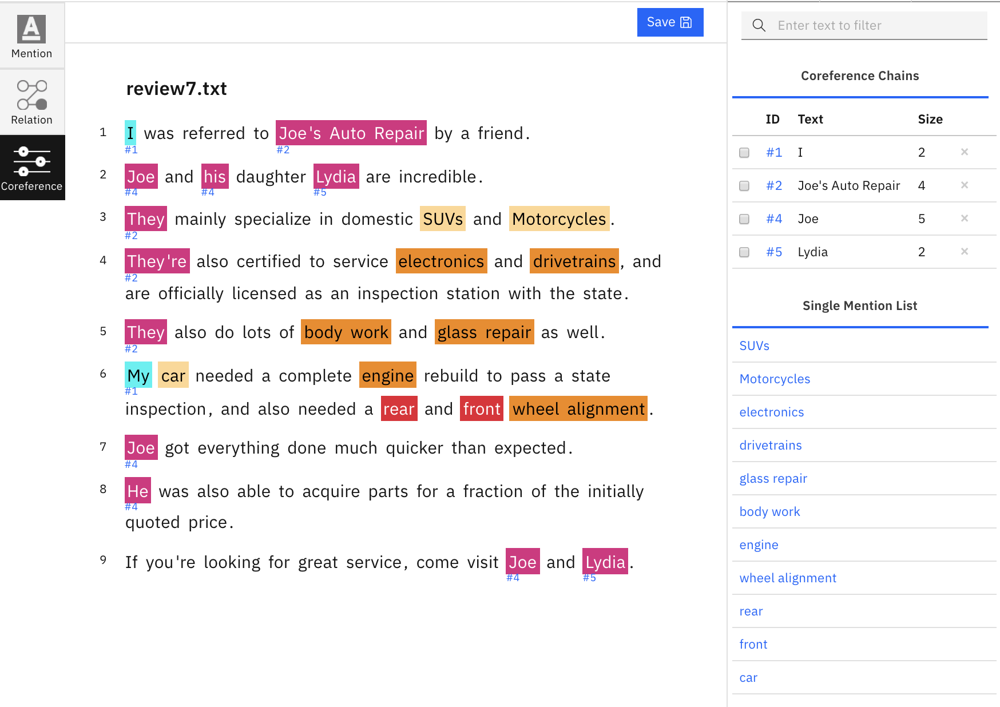

### 生成机器学习模型

在为几个文档添加注释后，您可以训练机器学习模型来为其余未标记的文档添加注释。也可以通过 API 来公开该模型，我们将在下一步中展示此操作。

1. 通过选择 **Performance** 来创建模型。

1. 单击 **Train and evaluate**。

    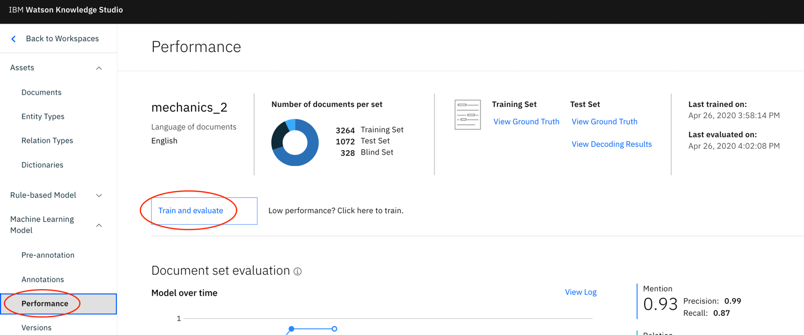

1. 如果要选择接受特定文档的训练，或者调整您的测试、训练和盲训练子集，请单击 **Edit Settings**。

    

1. 确认您的训练设置，然后单击 **Train & Evaluate**。

    

完成训练后，您可以将自定义的机器学习模型部署到 Watson Natural Language Understanding 服务。此部署通过 API 创建自定义的机器学习模型。

1. 单击 **Versions** 来查看经过训练的模型，然后单击 **Deploy**。

    

1. 选择 **Natural Language Understanding**，然后单击 **Next**。

    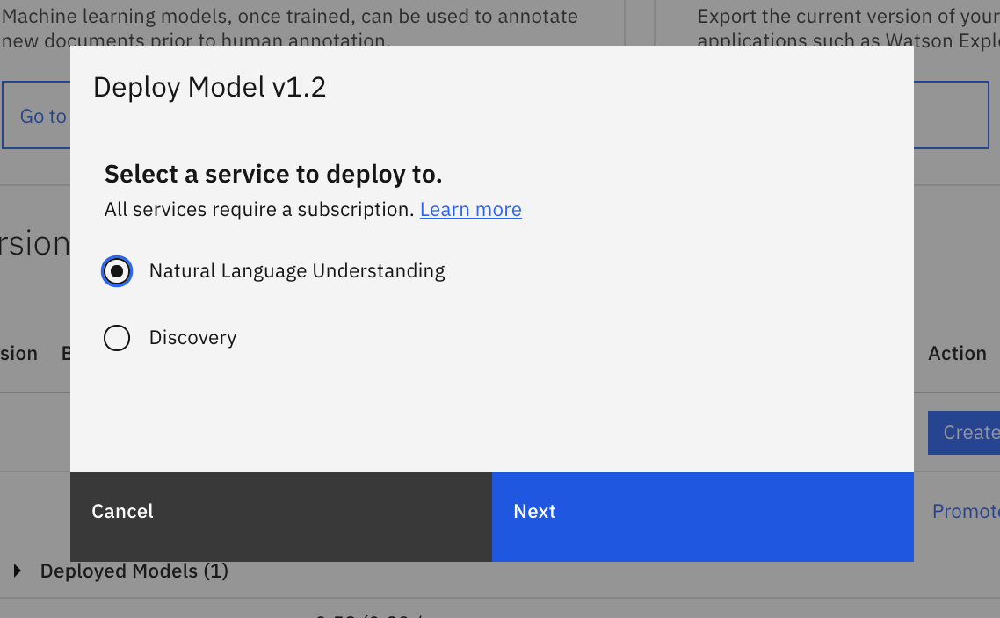

1. 选择您的地区、资源组和服务名称，然后单击 **Deploy**。

完成部署后，您应该在 Deployed Models 列表中看到一个新条目。展开该条目以获取您的模型 ID。


### 将模型部署到 Watson Natural Language Understanding

现在，您应该能够通过将数据发布到 API 来测试模型。为此，您将需要以下凭证。

* Natural Language Understanding API 密钥
* Natural Language Understanding URL
* Watson Knowledge Studio 部署模型 ID（已从上一部分的末尾获取）

通过导航到 Watson Natural Language Understanding 实例页面并查看 Credentials 部分，可以找到 Natural Language Understanding API 密钥和 URL。

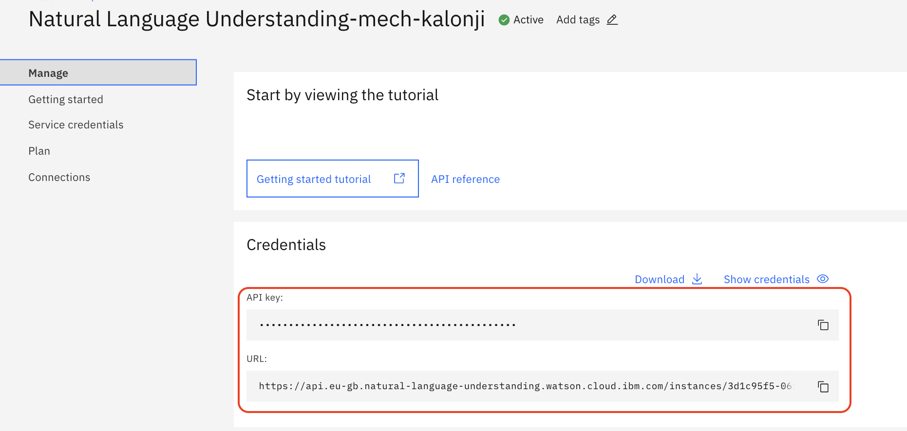

使用以下代码来创建一个 .json 文件。在该文件中，将 `model_id` 替换为 Watson Knowledge Studio 生成的部署 ID。另外，在 `<input text>` 部分中插入以下文本：**My truck windshield was cracked, so I went to Joe's Auto shop and they replaced it for me.They did an excellent job.I would highly recommend them**。

```
{
  "text": "<input_text>",
  "features": {
    "entities": {
      "model": "<model_id>"
    },
    "keywords": {
      "emotion": true,
      "sentiment": true
    },
    "emotion": {
        "sentiment": true
    },
    "categories": {
      "sentiment": true
    },
    "relations": {
      "model": "<model_id>"
    },
    "sentiment": {}
  }
}
```

运行 curl 命令以使用生成的机器学习模型来分析文本。确保使用您的服务凭证更新了 `nluApiKey` 和 `nluUrl` 字段。另外，还要添加 .json 文件的路径。

```
curl -X POST \
  -u "apikey":"<nluApiKey> \  
  -H "Content-Type: application/json" \
  -d @<path to json file> \
  "<nluUrl>/v1/analyze?version=2019-07-12"
```

在 sentiment 部分中，您会看到该评论被标记为肯定。在 entities 部分中，您可以识别出已完成了哪些维修。

```
"sentiment": {
  "document": {
    "score": 0.952598,
    "label": "positive"
  }
},
```

```
"entities": [
  {
    "type": "Repair",
    "text": "windshield",
    "disambiguation": {
      "subtype": [
        "Glass"
      ]
    },
    "count": 1,
    "confidence": 0.994622
  },
```

## 结束语

在本教程中，您了解了如何为一组文档添加注释以对评论进行准确分类。在随后的 [Code Pattern](https://developer.ibm.com/zh/patterns/build-a-virtual-insurance-assistant-to-process-insurance-claims/) 中，您将了解如何汇总每个修理技师的 Natural Language Understanding 结果并确定某种给定维修类型的最佳修理技师。本教程是[构建客户服务解决方案](https://developer.ibm.com/zh/articles/insurance-industry-customer-care-solution)的一部分，可帮助客户管理保险索赔并获取汽车服务信息。

本文翻译自：[Build a recommendation engine with Watson Natural Language Understanding](https://developer.ibm.com/tutorials/build-a-recommendation-engine-with-watson-natural-language-understanding/)（2020-06-29）
