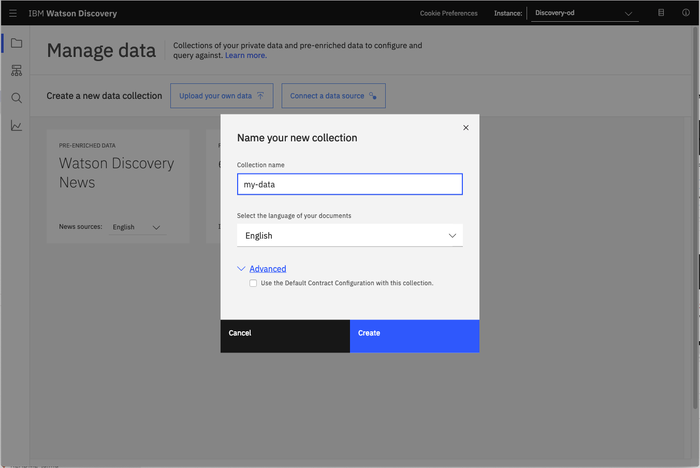
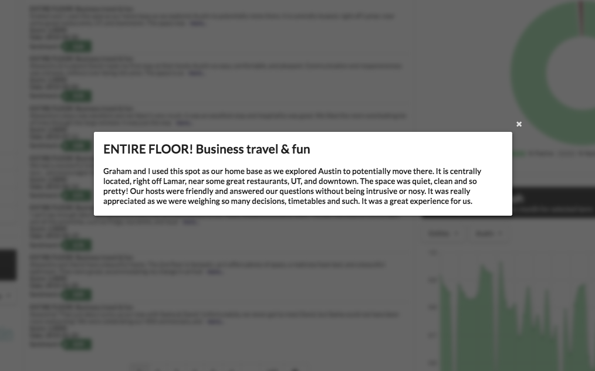

# Learn the basics of extracting business insight using Watson Discovery

## Learning outcomes

At the end of this module, attendees will understand all the different types of data, and the type of functions and queries they can apply to learn the most from the data they are trying to analyze.

Content:

* ~~What is Watson Discovery and how does it work~~
* Airbnb example of using Watson Discovery to extract insights
  * Uploading and configuring data
  * Extracting basic insights

## Summary

A standard search for a site can return too many results for someone to want to go through. However, it's possible to quickly build out a search interface for your IBM Watson Discovery instance using out-of-the-box UI components that query and manipulate the enriched data to return more relevant search results. This code pattern uses publicly available reviews on Airbnb listings to demonstrate how to use individual UI components to visualize insights. You can then easily switch out the data set to adapt it to your own use cases.

## Description

By querying and manipulating enriched data, you can build a more insightful search interface. This code pattern provides a Node.js app built on the Watson Discovery Service that does just that. The pattern demonstrates how you can use individual out-of-the-box UI components to extract and visualize the enriched data provided by the Discovery analytics engine.

The main benefit of using the Watson Discovery Service is its powerful analytics engine that provides cognitive enrichments and insights into your data. The app in this code pattern provides examples of how to showcase these enrichments through the use of filters, lists, and graphs. The key enrichments are:

* Entities: People, companies, organizations, cities, and more
* Categories: Classification of the data into a hierarchy of categories up to 5 levels deep
* Concepts: Identified general concepts that aren't necessarily referenced in the data
* Keywords: Important topics typically used to index or search the data
* Sentiment: The overall positive or negative sentiment of each document

The app uses standard search UI components such as filter lists, tag clouds, and sentiment graphs, but also more complex Discovery options such as the passages and highlight features. With these two features, the app identifies the most relevant snippets in your data based on your query and is more likely to return the data that you're searching for.

When you have completed this code pattern, you should know how to:

* Load and enrich data in the Watson Discovery Service
* Query and manipulate data in the Watson Discovery Service
* Create UI components to represent enriched data created by the Watson Discovery Service
* Build a complete web app that uses popular JavaScript technologies to feature Watson Discovery Service data and enrichments

## Flow


1. Add the Airbnb review JSON files to the Discovery collection.
1. Use the app UI to interact with the back-end server. The front-end app UI uses React to render search results and can reuse all of the views that are used by the back end for server-side rendering. The front end is using semantic-ui-react components and is responsive.
1. Discovery processes input and routes it to the back-end server, which is responsible for server-side rendering of the views displayed on the browser. The back-end server is written using Express and uses an express-react-views engine to render views that are written using React.
1. The back-end server sends user requests to the Watson Discovery Service. It acts as a proxy server, forwarding queries from the front end to the Watson Discovery Service API while keeping sensitive API keys concealed from the user.

## UI controls and associated actions

Here is a rough sketch of the main UI screen, followed by a description of each UI component and their assoicated actions:


1. Search field and search parameters: Return results based on search criteria. Search parameters will effect how the user will enter values, how they will be displayed, and limit the number of matches.
1. List Filters: Multiple drop-down lists of filters that are applied to the search resullts. Each drop down list contains entities, categories, concepts and keywords associated with the results. For each drop down filter item, the number of matches will also be displayed. If a user selects a filter item, a new search will be conducted and will update the results panel (#3). Filter items selected will also effect what is shown in the tag cloud (#4).
1. Search results and pagination menu: Shows a page of result items (e.g. 5 per page) and a pagination menu to allow the user to scroll through pages of result items. There will also be a drop-down menu that will allow the user to sort the entries based on date, score, and sentiment value.
1. Tag cloud filter: Similar to the list filters (#2) but in a different format. One set of filter items (either entities, categories, concepts or keywords) can be displayed at one time. User can select/deselect items in the cloud to turn on/off filters. Applied filters in both filter views (#2 and #4) will always be in sync.
1. Trend chart: Chart to show the sentiment trend for a specific entity, category, concept, or keyword over time. The data will reflect the current matching result set.
1. Sentiment chart: Donut chart that shows the total percentages of postive, neutral and negative reviews of selected entities, categories, concepts, or keywords. The data will reflect the current matching result set.

<!-- 
## Watson Discovery Continuous Relevancy Training

This feature provides the ability of the Discovery service to learn from user behavior. By clicking on the "read more" button attached to each review, the user can inform Discovery that a particular review is more relevant than other non-clicked reviews. Discovery can than use that information to improve the ranking of results for future queries.

For more information about this feature, read about it [here](https://cloud.ibm.com/docs/services/discovery/continuous-training.html#crt).

https://cloud.ibm.com/docs/discovery?topic=discovery-crt

> NOTE: This feature is only available with the "advanced" Watson Discovery service plan. This code pattern assumes the "lite" or "free" plan, so this feature is not enabled by default. For those users with the ability to create a paid Discovery plan, please link to the [`advanced-disco-plan`](https://github.com/IBM/watson-discovery-ui/tree/advanced-disco-plan) branch associated with this repo. The instructions and the `Deploy to IBM Cloud` button on that branch will initiate the creation of an "advanced" Discovery service.
-->

## Steps

1. [Clone the repo](#1-clone-the-repo)
1. [Create your Watson Discovery service](#2-create-your-watson-discovery-service)
1. [Load Discovery files and configure collection](#3-load-discovery-files-and-configure-collection)
1. [Add Watson Discovery credentials](#4-add-watson-discovery-credentials)
1. [Run the application](#5-run-the-application)

## 1. Clone the repo

```bash
git clone https://github.com/IBM/watson-discovery-ui
```

## 2. Create your Watson Discovery service

To create your Watson Discovery service:

  1. Click **Create resource** on your IBM Cloud dashboard.

  2. Search the catalog for `discovery`.

  3. Click the **Discovery** tile to launch the create panel.


From the panel, enter a unique name, a region and resource group, and a plan type (select the default **lite** plan). Click **Create** to create and enable your service.

## 3. Load Discovery files and configure collection

Launch the **Watson Discovery** tool. Create a new data collection by selecting the **Update your own data** option. Give the data collection a unique name.



When prompted to get started by **uploading your data**, select and upload the first 2 json documents located in your local `data/airbnb` directory. Once uploaded, you can then use the **Configure data** option to add the **Keyword Extraction** enrichment, as show here:


> Note: failure to do this will result in no **keywords** being shown in the app.

Once the enrichments are selected, use the **Apply changes to collection** button to upload the remaining json files found in `data/airbnb`. **Warning** - this make take several minutes to complete.

> There may be a limit to the number of files you can upload, based on your IBM Cloud account permissions.

## 4. Add Watson Discovery credentials

Next, you'll need to add the Watson Discovery credentials to the .env file.

1. From the home directory of your cloned local repo, create a .env file by copying it from the sample version.

```bash
cp env.sample .env
```

2. Locate the service credentials listed on the home page of your Discovery service and copy the `API Key` and `URL` values.


3. From your Discovery service collection page, locate the credentials for your collection by clicking the dropdown button located at the top right. Copy the `Collection ID` and `Environment ID` values.

<p align="center">
  
</p>

4. Take the copied values and paste them into the `.env` file:

```bash
# Copy this file to .env and replace the credentials with
# your own before starting the app.

# Watson Discovery
DISCOVERY_URL=<add_discovery_url>
DISCOVERY_ENVIRONMENT_ID=<add_discovery_environment_id>
DISCOVERY_COLLECTION_ID=<add_discovery_collection_id>
DISCOVERY_APIKEY=<add_discovery_iam_apikey>

# Run locally on a non-default port (default is 3000)
# PORT=3000
```

## 5. Run the application

Install [Node.js](https://nodejs.org/en/) runtime or NPM.

Then run:

```bash
npm install
npm start
```

The application will be available in your browser at `http://localhost:3000`.

> Note: server host can be changed as required in app.js and `PORT` can be set in the `.env` file.

<!-- 
## Deployment options

Click on one of the options below for instructions on deploying the app.

|   |   |   |
| - | - | - |
| [](doc/source/openshift.md) | [](doc/source/cf.md) | [](doc/source/local.md) |

-->

# Sample UI layout


Note that each review will be truncated to 200 characters or less. A `more...` button will be provided for each review, and when clicked, the full review title and text will be displayed in a pop-up modal window, as shown below:



If the `more...` button is clicked, the review data will be passed back to Discovery so that it can be logged as a relevant review for the query. Refer to the [Watson Discovery Continuous Relevancy Training](#watson-discovery-continuous-relevancy-training) section above for more information on this feature.

# Troubleshooting

* Error: Environment {GUID} is still not active, retry once status is active

  > This is common during the first run. The app tries to start before the Discovery
environment is fully created. Allow a minute or two to pass. The environment should
be usable on restart. If you used `Deploy to IBM Cloud` the restart should be automatic.

* Error: Only one free environment is allowed per organization

  > To work with a free trial, a small free Discovery environment is created. If you already have a Discovery environment, this will fail. If you are not using Discovery, check for an old service thay you may want to delete. Otherwise use the .env DISCOVERY_ENVIRONMENT_ID to tell the app which environment you want it to use. A collection will be created in this environment using the default configuration.

* Error when loading files into Discovery

  > Loading all 2000 document files at one time into Discovery can sometimes lead to "busy" errors. If this occurs, start over and load a small number of files at a time.

* No keywords appear in the app

  > This can be due to not having a proper configuration file assigned to your data collection. See [Step 3](#3-load-the-discovery-files) above.

* When using the `Deploy to IBM Cloud` button, you get a failure during the `Deploy Stage`, as shown in this log message:

  

  > This can occur if the discovery service is not yet provisioned (you can check the resourse list in the `IBM Cloud` dashboard to verify). If so, wait until the service is marked as `Provisioned`, and then hit the `Redeploy` button at the top of the `Deply Stage` panel. After successfully deploying and connecting to the discovery service, check the logs of the running deployed app to check its progress as it loads the json files into the discovery collection.

## Conclusion

This code pattern explains how you can use individual out-of-the-box UI components to extract and visualize the enriched data provided by the Discovery analytics engine.
