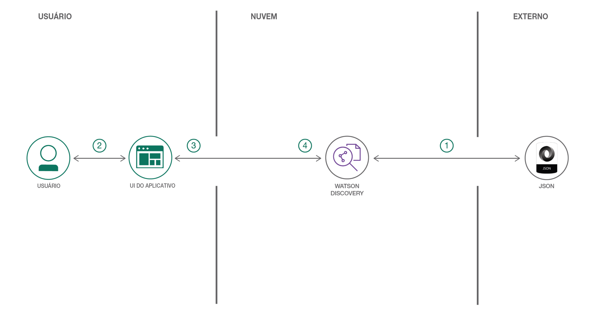

## Apresentação

Uma procura padrão por um site pode retornar vários resultados para alguém que deseja seguir adiante. No entanto, é possível desenvolver rapidamente uma interface de procura para sua instância do Watson Discovery utilizando componentes de UI simples de instalar que consultem e manipulem os dados enriquecidos para retornar resultados de procura mais relevantes. Este padrão de código utiliza revisões publicamente disponíveis sobre listagens da Airbnb para demonstrar como usar componentes individuais da UI na visualização de insights. É possível trocar facilmente o conjunto de dados para adaptá-lo aos seus próprios casos de uso.

## Descrição

Com a consulta e a manipulação de dados enriquecidos, é possível desenvolver uma interface de procura com mais insights. Este padrão de código fornece um aplicativo Node.js baseado no Watson Discovery Service que faz exatamente isso. O padrão demonstra como é possível usar componentes de UI simples de instalar para extrair e visualizar os dados enriquecidos fornecidos pelo mecanismo de análise Watson Discovery.

O principal benefício do uso do Watson Discovery Service é seu eficiente mecanismo de análise, que fornece enriquecimentos cognitivos e insights para seus dados. O aplicativo neste padrão de código fornece exemplos de como mostrar esses enriquecimentos utilizando filtros, listas e gráficos. Os principais enriquecimentos são:

* Entidades: pessoas, empresas, organizações, cidades e mais.
* Categorias: classificação dos dados em uma hierarquia de categorias de até cinco níveis de profundidade.
* Conceitos: conceitos gerais identificados que não são necessariamente referenciados nos dados.
* Palavras-chave: tópicos importantes normalmente usados para indexar ou procurar os dados.
* Impressão: a impressão geral positiva ou negativa de cada documento.

O aplicativo usa os componentes de UI de procura, como listas de filtro, nuvens de tag e gráficos de impressão, mas também opções mais complexas do Discovery, como recursos de trechos e destaques. Com esses dois recursos, o aplicativo identifica os fragmentos mais relevantes em seus dados com base em sua consulta e tem mais chance de retornar os dados que você está procurando.

Após concluir esse padrão de código, você deverá saber:

* Carregar e enriquecer dados no Watson Discovery Service.
* Consultar e manipular dados no Watson Discovery Service.
* Criar componentes de UI para representar dados enriquecidos criados pelo Watson Discovery Service.
* Desenvolver um aplicativo web completo que utilize tecnologias JavaScript populares para apresentar dados e enriquecimentos do Watson Discovery Service.

## Fluxo

1. Inclua os arquivos JSON de revisão da Airbnb na coleção do Discovery.
1. Use a UI do aplicativo para interagir com o servidor de backend. A UI do aplicativo frontend usa React para renderizar resultados da procura e pode reutilizar todas as visualizações usadas pelo backend para renderização do lado do servidor. O frontend está usando componentes semantic-ui-react e é responsivo.
1. O Discovery processa a entrada e a roteia para o servidor de backend, que é responsável pela renderização do lado do servidor das visualizações exibidas no navegador. O servidor de backend é gravado usando Express e utiliza um mecanismo express-react-views para renderizar visualizações gravadas usando React.
1. O servidor de backend envia solicitações do usuário para o Watson Discovery Service. Ele age como um servidor proxy, encaminhando consultas do frontend para a API do Watson Discovery Service, enquanto mantém chaves API sensíveis escondidas do usuário.

## Aviso

O conteúdo aqui presente foi traduzido da página IBM Developer US. Caso haja qualquer divergência de texto e/ou versões, consulte [o conteúdo original](https://developer.ibm.com/patterns/create-an-app-to-perform-intelligent-searches-on-data/).
