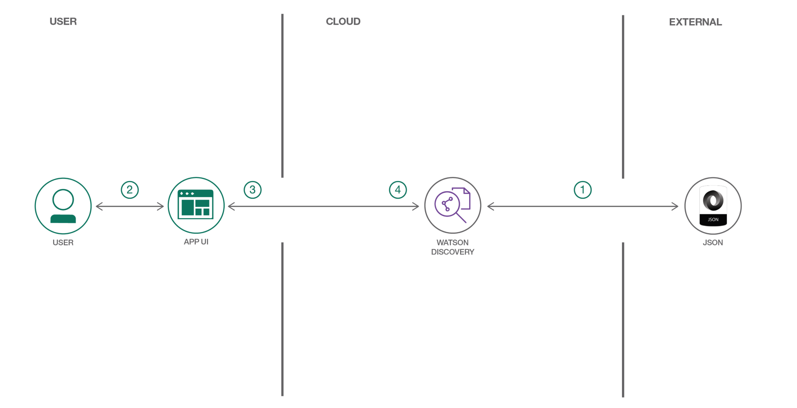

**This code pattern is part of the [Watson Discovery learning path](https://developer.ibm.com/series/learning-path-watson-discovery)**.

| Level | Topic | Type |
| --- | --- | --- |
| 100 | [Introducción a Watson Discovery](https://developer.ibm.com/articles/introduction-watson-discovery) | Artículo |
| 101 | [Cree una aplicación cognitiva de búsqueda de noticias](https://developer.ibm.com/patterns/create-a-cognitive-news-search-app/) | Code pattern |
| **201** | **[Cree una aplicación para realizar búsquedas inteligentes en los datos](https://developer.ibm.com/patterns/create-an-app-to-perform-intelligent-searches-on-data/)** | Code pattern |
| 301 | [Obtenga insights sobre el parecer de los clientes de las revisiones de los productos](https://developer.ibm.com/patterns/get-customer-insights-from-product-reviews/) | Code pattern |
| 401a | Mejore el centro de ayuda clientes con Smart Document Understanding usando [webhooks en Watson Assistant](https://developer.ibm.com/patterns/enhance-customer-help-desk-with-smart-document-understanding) | Code pattern |
| 401b | Mejore el centro de ayuda clientes utilizando la [habilidad de búsqueda de Watson Assistant](https://developer.ibm.com/patterns/enhance-customer-helpdesk-with-smart-document-understanding-using-search-skill) | Code pattern |

## Resumen

Una búsqueda estándar de un sitio puede de devolver demasiados resultados para alguien que quiere buscar entre ellos. Sin embargo, existe la posibilidad de desarrollar rápidamente una interfaz de búsqueda para una instancia de IBM Watson Discovery utilizando componentes preparados de una IU que consulten y manipulen los datos enriquecidos para devolver los resultados más relevantes de la búsqueda. Este code pattern utiliza comentarios que están disponibles públicamente en listados de Airbnb para demostrar cómo se utilizan los componentes individuales de la IU para visualizar conocimientos. A continuación, es posible alterar fácilmente el conjunto de datos, para adaptarlo a sus propios casos de uso.

## Descripción

Es posible consultar y manipular datos enriquecidos para desarrollar una interfaz de búsqueda más esclarecedora. Este code pattern proporciona una aplicación de Node.js que ha sido construida sobre el servicio Watson Discovery Service que hace exactamente eso. El patrón demuestra cómo utilizar componentes individuales preparados de la IU para extraer y visualizar los datos enriquecidos que brinda el motor analítico de Discovery.

La ventaja principal de usar Watson Discovery Services es su potente motor de analítica que proporciona un enriquecimiento cognitivo e insights sobre sus datos. La aplicación de este code pattern brinda ejemplos de cómo demostrar esos enriquecimientos a través del uso de filtros, listas y gráficos. Los principales enriquecimientos son:

* Entidades: personas, compañías, organizaciones, ciudades, etc.
* Categorías: clasificación de los datos en una jerarquía de categorías hasta 5 niveles de profundidad
* Conceptos: conceptos generales identificados que no están necesariamente referenciados en los datos
* Palabras clave: temas importantes que normalmente se utilizan para indexar o buscar en los datos
* Parecer: el parecer general, positivo o negativo, de cada documento

La aplicación utiliza componentes de búsqueda estándar de la IU, como listas de filtros, nubes de etiquetas y gráficos de sentimientos, aunque también utiliza opciones más complejas de Discovery, como los pasajes y las funciones de destaque. La aplicación utiliza esas dos funciones para identificar fragmentos más relevantes de los datos basándose en la consulta, y es más probable que devuelva los datos que se buscan.

Cuando haya completado este code pattern, usted debería saber:

* Cargar y enriquecer datos en Watson Discovery Service
* Consultar y manipular los datos en Watson Discovery Service
* Crear componentes de la IU para representar datos enriquecidos que han sido creados por Watson Discovery Service
* Desarrollar una aplicación web completa que utilice tecnologías populares de JavaScript para presentar enriquecimientos y datos de Watson Discovery Service

## Flujo

1. Añadir los archivos JSON de comentarios de Airbnb a la colección de Discovery.
1. Utilizar la IU de la aplicación para interactuar con el servidor backend. La IU de la aplicación frontend utiliza React para representar los resultados de la búsqueda y puede reutilizar todas las listas que el backend utiliza para representar por el lado del servidor. El frontend utiliza componentes de semantic-ui-react y tiene diseño adaptativo.
1. Discovery procesa los datos y los redirige al servidor backend, que es responsable de la representación por el lado del servidor de las vistas que se muestran en el navegador. El servidor backend se escribe con Express y utiliza un motor express-react-views para representar las vistas que se escriben con React.
1. El servidor backend envía las solicitudes de los usuarios a Watson Discovery Service. Actúa como servidor proxy, redirigiendo las consultas desde el frontend hasta la API de Watson Discovery Service mientras mantiene las claves confidenciales de la API ocultas para el usuario.

## Instrucciones

¿Listo para poner este code pattern en uso? Los detalles completos sobre cómo comenzar a ejecutar y a utilizar esta aplicación se encuentran en [README (En Inglés)](https://github.com/IBM/watson-discovery-ui/blob/master/README.md).

## Conclusión

Este code pattern explica cómo utilizar componentes individuales preparados de la IU para extraer y visualizar los datos enriquecidos que brinda el motor analítico de Discovery. Este code pattern forma parte de la serie [Ruta de Aprendizaje: Introducción a Watson Discovery](https://developer.ibm.com/series/learning-path-watson-discovery). Para continuar con la serie y conocer más funciones de Watson Discovery Service, vea el siguiente code pattern, [Obtener insights de sentimiento de los clientes de los comentarios de los productos](https://developer.ibm.com/patterns/get-customer-insights-from-product-reviews).

## Aviso

El contenido aquí presentado fue traducido de la página IBM Developer US. Puede revisar el contenido original en [este link](https://developer.ibm.com/patterns/create-an-app-to-perform-intelligent-searches-on-data/).
