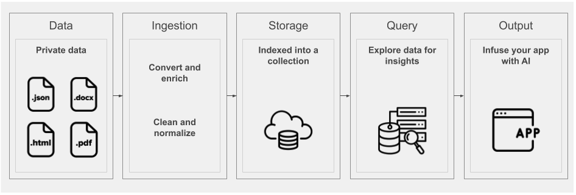
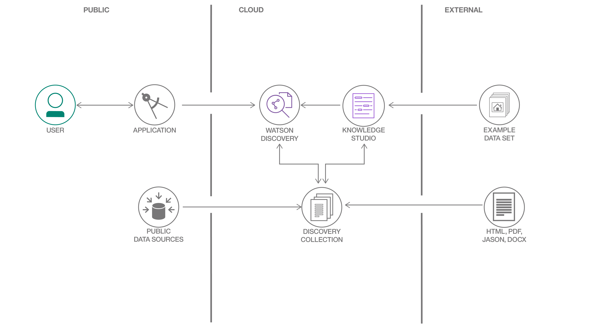

**This article is part of the [Watson Discovery learning path](https://developer.ibm.com/series/learning-path-watson-discovery)**.

| Level | Topic | Type |
| --- | --- | --- |
| **100** | **Introduction to Watson Discovery** | Article |
| 101 | [Create a cognitive news search app](https://developer.ibm.com/patterns/create-a-cognitive-news-search-app/) | Code pattern |
| 201 | [Create an app to perform intelligent searches on data](https://developer.ibm.com/patterns/create-an-app-to-perform-intelligent-searches-on-data/) | Code pattern |
| 301 | [Get customer sentiment insights from product reviews](https://developer.ibm.com/patterns/get-customer-insights-from-product-reviews/) | Code pattern |
| 401a | Enhance customer helpdesks with Smart Document Understanding using [webhooks in Watson Assistant](https://developer.ibm.com/patterns/enhance-customer-help-desk-with-smart-document-understanding) | Code pattern |
| 401b | Enhance customer helpdesks with Smart Document Understanding using the [Watson Assistant search skill](https://developer.ibm.com/patterns/enhance-customer-helpdesk-with-smart-document-understanding-using-search-skill) | Code pattern |

## Introduction

With IBM Watson Discovery, you can ingest, normalize, enrich, and search your unstructured data (JSON, HTML, PDF, Word, and more) with speed and accuracy. It packages core Watson APIs such as Natural Language Understanding and Document Conversion along with UI tools that enable you to easily upload, enrich, and index large collections of private or public data.

The following image shows a high-level view of all of the components that make up the Discovery pipeline.



This article is the first part of a [learning path](https://developer.ibm.com/series/learning-path-watson-discovery) that helps you gain a better understanding about how Discovery works, and how you can use it to build your own artificial intelligence (AI) solutions.

## Terms and concepts

### Watson Discovery service terms

This section covers the terms and concepts that are specific to Discovery.

| Term | Definition |
| ---  |   ---      |
| [Collection](https://cloud.ibm.com/docs/services/discovery?topic=discovery-addcontent#adding-content-with-the-api-or-tooling) | A collection is a logical division of your data in an environment and is queried independently. |
| [Configuration](https://cloud.ibm.com/docs/services/discovery?topic=discovery-configservice) | A configuration can be assigned to a collection and can be used to convert and normalize data as well as specify which enrichments to apply. |
| [Enrichments](#enrichments) | Discovery contains a powerful analytics engine that provides cognitive enrichments and insights into your data. These enrichments include entities, categories, concepts, keywords, and sentiment. |
| [Aggregations](https://cloud.ibm.com/docs/services/discovery?topic=discovery-query-reference#aggregations) | This refers to Discovery returning a set of data values, such as the top values for selected enrichments. For example, it can return the top 10 concepts that appear in a data collection. |
| [Passages](https://cloud.ibm.com/docs/services/discovery?topic=discovery-query-parameters#passages) | When working with large documents, you can use the passage search feature to return short and relevant excerpts related to the best matches. |
| [Discovery Query Language](https://cloud.ibm.com/docs/services/discovery?topic=discovery-query-concepts) | The syntax of the queries that you would use to search for results, using field names, operators, and keywords. |
| [Natural Language Query](https://cloud.ibm.com/docs/services/discovery?topic=discovery-query-parameters#nlq) | As an alternative to strict query language, you can also query the language with simple phrases, such as "How do I save a file." |
| [Watson Discovery News](https://cloud.ibm.com/docs/services/discovery?topic=discovery-watson-discovery-news) | A collection that is included with every created Discovery service. It is an indexed data set that is updated daily with over 300,000 news articles. |
| [Watson Discovery tooling](#tooling) | The extensive set of UI tools available from the IBM Cloud console that you can use to create and populate your collection, apply enrichments, and query and test your data. |

### Enrichments

Discovery has a powerful analytics engine that provides cognitive enrichments and insights into your data. With built-in natural language processing (NLP) capabilities, it can extract enrichments from a wide range of document types, such as JSON, HTML, PDF, and Microsoft&trade; Word. The following table shows the key enrichments.

| Enrichment | Definition |
| ---   |   ---      |
| Entity | People, companies, organizations, cities, and geographic features |
| Sentiment | Identifies the overall positive or negative sentiment |
| Keyword | Determines important keywords, ranks them, and, optionally, detects the sentiment |
| Concept | Identifies general concepts that aren't necessarily directly referenced |
| Classification | Classifies into a hierarchy of categories that's five levels deep |
| Relationships | Parses sentences into subject, action, and action form, and returns additional semantic information |
| Emotion | Analyses the emotions such as anger, disgust, fear, joy, and sadness |

The ability to make natural language queries on these enrichments provides an advantage over typical keyword search engines.

## Architecture



A common way to use Discovery is by accessing the Discovery APIs from your application. The Watson team releases [SDKs](#sdks) that support many programming languages so that you can use Discovery easily in a web or mobile application.

All of the data content is stored and enriched within a Discovery collection. The data does not require any specific structure and can come from multiple public and private data sources. Every Discovery environment comes with a pre-enriched data collection named Watson Discovery News.

Optionally, with Watson Knowledge Studio, you can use domain experts to help customize Discovery to better understand the unique entities and relationships in your specific industry or organizational data.

Some typical use cases for Discovery include:

* *The need to search thousands of product reviews at once*: Create a Discovery collection and build a UI to query the collection and graph the sentiment over time.
* *The need to programmatically find text within a document*: Use the passage retrieval feature of Discovery to create an FAQ chatbot.
* *There are thousands of documents in different formats and you need to organize them logically*: Use Discovery to pull out keywords, concepts, and relationships to sort them.

## Accessing Discovery

### Tooling

As mentioned previously, Discovery has its own set of tooling that is available through the IBM Cloud, and which provides a UI to manually manage your Discovery collections.

The following video shows how you can use the tool to create a new data collection and then ingest data files for enrichment.


The following demo shows using the tooling to access the service, create a data collection, and query the data.

<iframe align="middle" width="600" height="315" src="https://www.youtube.com/embed/kwmqJRDbv98" frameborder="0" allow="accelerometer; autoplay; encrypted-media; gyroscope; picture-in-picture" allowfullscreen></iframe>

<br>

The [Discovery Getting started](https://cloud.ibm.com/docs/services/discovery?topic=discovery-getting-started) tutorial provides another great resource for information on all tooling features.

### SDKs

For programmatic access, Discovery comes with support for a large number of languages. The following list shows the current developer SDKs.

* [Node SDK](https://github.com/watson-developer-cloud/node-sdk)
* [Python SDK](https://github.com/watson-developer-cloud/python-sdk)
* [Swift SDK](https://github.com/watson-developer-cloud/swift-sdk)
* [Java&trade; SDK](https://github.com/watson-developer-cloud/java-sdk)
* [Go SDK](https://github.com/watson-developer-cloud/go-sdk)
* [Ruby SDK](https://github.com/watson-developer-cloud/ruby-sdk)
* [.NET SDK](https://github.com/watson-developer-cloud/dotnet-standard-sdk)
* [Salesforce SDK](https://github.com/watson-developer-cloud/salesforce-sdk)

### APIs

For more information on the APIs, see the [Discovery API documentation](https://cloud.ibm.com/apidocs/discovery?cm_sp=ibmdev-_-developer-articles-_-cloudreg).

### Code sample

The following Node.js code sample shows how to authorize and query your Discovery collection. If you need more information on query concepts, look at the Discovery [documentation](https://cloud.ibm.com/docs/services/discovery?topic=discovery-query-concepts#query-concepts).

```javascript
const DiscoveryV1 = require('watson-developer-cloud/discovery/v1');

const discovery = new DiscoveryV1({
  version: '2019-04-02',
  iam_apikey: '{apikey}',
  url: '{url}',
});

const queryParams = {
  environment_id: '{environment_id}',
  collection_id: '{collection_id}',
};

discovery.query(queryParams)
  .then(queryResponse => {
    console.log(JSON.stringify(queryResponse, null, 2));
  })
  .catch(err => {
    console.log('error:', err);
  });
```

## Summary

This article is the first part of a [learning path](https://developer.ibm.com/series/learning-path-watson-discovery) that guides you through building fully featured web apps that are built on the Watson Discovery Service. Within this learning path, you'll get a chance to work with advanced Discovery features, as well as learn how to integrate Discovery with other Watson services.

So let's get started. The [first step](https://developer.ibm.com/patterns/create-a-cognitive-news-search-app/) will be to build a simple app that accesses Watson Discovery News.
