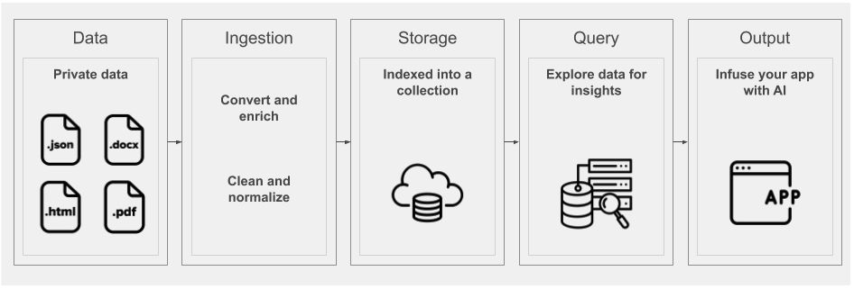

**この記事は、[Watson Discovery ラーニング・パス](https://developer.ibm.com/series/learning-path-watson-discovery)の一部となっています。**

| レベル | トピック |
| --- | --- |
| **100** | **[Watson Discovery 入門](/jp/articles/introduction-watson-discovery/)** |
| 101 | [コグニティブ・ニュース検索アプリを作成する](/jp/patterns/create-a-cognitive-news-search-app) |
| 201 | [インテリジェントにデータを検索するアプリを作成する](/jp/patterns/create-an-app-to-perform-intelligent-searches-on-data) |
| 301 | [製品のレビューから顧客についての洞察を得る](/jp/patterns/get-customer-insights-from-product-reviews/) |
| 401 | [Smart Document Understanding によってカスタマー・ヘルプデスクの対応を強化する](/jp/patterns/enhance-customer-help-desk-with-smart-document-understanding) |

## はじめに

IBM Watson Discovery を利用すると、非構造化データ (JSON、HTML、PDF、Word など) を取り込んで正規化およびエンリッチし、素早く正確にデータを検索することができます。IBM Watson Discovery にはコアとなる Watson Natural Language Understanding や Watson Document Conversion などの Watson API に加え、大量のプライべート・データまたはパブリック・データのコレクションを簡単にアップロード、エンリッチ、インデックス付けするために使用できる一連の UI ツールがパッケージ化されています。

以下の図に、Watson Discovery パイプラインを構成するすべてのコンポーネントの概要を示します。



この記事は、Watson Discovery について学ぶ[ラーニング・パス](https://developer.ibm.com/series/learning-path-watson-discovery)の最初のパートです。この記事で Watson Discovery の仕組みを理解した後は、残りのラーニング・パスに従って、このサービスを利用して独自の人工知能 (AI) ソリューションを構築する方法を学んでください。

## 用語と概念

### Watson Discovery サービスの用語

このセクションでは、Watson Discovery に固有の用語と概念について説明します。

| 用語 | 定義 |
| ---  |   ---      |
| [コレクション](https://cloud.ibm.com/docs/services/discovery?topic=discovery-addcontent#adding-content-with-the-api-or-tooling) | コレクションとは、環境内のデータを論理的に区分したものです。コレクションは個別に照会されます。|
| [構成](https://cloud.ibm.com/docs/services/discovery?topic=discovery-configservice) | 各コレクションには構成を割り当てることができます。構成を使用して、データを変換、正規化したり、データに適用するエンリッチメントを指定したりできます。|
| [エンリッチメント](#enrichments) | Discovery が使用する強力なアナリティクス・エンジンは、コグニティブ・エンリッチメントを適用してデータに関する洞察を引き出します。エンリッチメントは、エンティティー、カテゴリー、概念、キーワード、センチメントを抽出するために使用できます。|
| [集約](https://cloud.ibm.com/docs/services/discovery?topic=discovery-query-reference#aggregations) | 集約とは、Discovery から一連のデータ値 (選択したエンリッチメントの上位の値など) を返すことを意味します。集約を使用すると、例えばデータ・コレクション内に頻繁に出現する 上位 10 の概念を返すことができます。|
| [パッセージ](https://cloud.ibm.com/docs/services/discovery?topic=discovery-query-parameters#passages) | 大量のドキュメントを扱う場合、パッケージ検索機能を使用すると、最適一致から抽出された短い、最も関連性の高いパッセージを取得することができます。|
| [Discovery 照会言語](https://cloud.ibm.com/docs/services/discovery?topic=discovery-query-concepts) | 結果を検索するための照会の構文では、フィールド名、演算子、キーワードを使用します。|
| [自然言語照会](https://cloud.ibm.com/docs/services/discovery?topic=discovery-query-parameters#nlq) | 厳密な照会言語の代わりに、単純なフレーズ (「How do I save a file (ファイルを保存する方法は)」)を使用して照会を実行することもできます。|
| [Watson Discovery News](https://cloud.ibm.com/docs/services/discovery?topic=discovery-watson-discovery-news) | 作成する Discovery サービス・インスタンスに例外なく組み込まれるコレクション。英語版のコレクションには、毎日約 300,000 の新しい記事で更新される、インデックス付けされたデータセットが含まれます。|
| [Watson Discovery ツール](#tooling) | IBM Cloud コンソールから利用できる包括的な UI ツール一式を使用して、コレクションを作成してデータを取り込む、エンリッチメントを適用する、データを照会してテストするなどの操作を行うことができます。|

### エンリッチメント

Discovery が使用する強力なアナリティクス・エンジンは、コグニティブ・エンリッチメントを適用してデータに関する洞察を引き出します。組み込みの自然言語処理 (NLP) 機能を使用して、JSON、HTML、PDF、Microsoft&trade; Word などの各種のドキュメントからエンリッチメントを抽出することができます。以下の表に、主なエンリッチメントを記載します。

| エンリッチメント | 定義 |
| ---   |   ---      |
| エンティティー | 人、企業、組織、都市、地理的特徴 |
| センチメント | 全体的なセンチメントがポジティブなものであるか、ネガティブなものであるかを識別します。 |
| キーワード | 重要なキーワードを判断してランクを付けます。必要に応じてセンチメントを検出することもできます。 |
| 概念 | 必ずしも直接参照されているわけではない、一般的な概念を識別します。 |
| 分類 | レベル 5 までの深さの階層に分類します。 |
| 関係 | センテンスを構文解析して主語、動詞、動詞の形態に分解し、追加の意味情報を返します。 |
| 感情 | 怒り、嫌悪、恐れ、喜び、悲しみなどの感情を分析します。 |

これらのエンリッチメントに基づく自然言語照会を行えることが、一般的なキーワード検索エンジンに勝るメリットです。

## アーキテクチャー


Discovery を利用するには、一般的な方法として、アプリケーションから Discovery API にアクセスします。Watson チームは多数のプログラミング言語をサポートする [SDK](#sdks) をリリースしているので、Web アプリケーションであってもモバイル・アプリケーションであっても簡単に Discovery を利用できます。

データ・コンテンツはすべて、Discovery コレクション内に保管されてエンリッチされます。データの構造に関する要件はありません。さまざまなパブリック・データ・ソースとプライベート・データ・ソースからデータを取り込むことができます。Discovery 環境には例外なく、Watson Discovery News という事前にエンリッチされたデータ・コレクションが付随しています。

Watson Knowledge Studio との連携により、必要に応じて領域専門家を関与させて、特定の業界または組織のデータに含まれる特有のエンティティーと関係を理解するように Discovery をカスタマイズすることもできます。

Discovery の一般的な使用ケースとしては、以下のシナリオが挙げられます。

* *数千件もの製品レビューを一度に検索する必要がある*: Discovery コレクションを作成し、このコレクションを照会して一定期間にわたるセンチメントをグラフ化する UI を構築します。
* *ドキュメント内のテキストをプログラムによって検索する必要がある*: Discovery のパッケージ検索機能を使用して FAQ チャットボットを作成します。
* *形式がさまざまに異なる数千のドキュメントを論理的に整理する必要がある*: Discovery を利用してキーワード、概念、関係を抽出し、これらの要素を基準にドキュメントを分類します。

## Discovery にアクセスする

### ツール

前述のとおり、Discovery には IBM Cloud からアクセスできる独自のツール・セットが用意されています。その中には、Discovery コレクションを手作業で管理するための UI もあります。

以下の動画で、このツールをS使用して新しいデータ・コレクションを作成し、そのコレクションにデータ・ファイルを取り込んでエンリッチメントを適用する方法を説明しています。


ツールを使用してサービスにアクセスする方法、データ・コレクションを作成する方法、データを照会する方法については、以下のデモ動画をご覧ください。

<iframe align="middle" width="600" height="315" src="https://www.youtube.com/embed/kwmqJRDbv98" frameborder="0" allow="accelerometer; autoplay; encrypted-media; gyroscope; picture-in-picture" allowfullscreen></iframe>

<br>

ツールの機能について調べるには、[Discovery 入門](https://cloud.ibm.com/docs/services/discovery?topic=discovery-getting-started)チュートリアルも役立ちます。

### SDK

プログラムによってアクセスする場合、Discovery にはさまざまなプログラミング言語のサポートが用意されています。以下に、現在の開発者用 SDK をリストアップします。

* [Node SDK](https://github.com/watson-developer-cloud/node-sdk)
* [Python SDK](https://github.com/watson-developer-cloud/python-sdk)
* [Swift SDK](https://github.com/watson-developer-cloud/swift-sdk)
* [Java&trade; SDK](https://github.com/watson-developer-cloud/java-sdk)
* [Go SDK](https://github.com/watson-developer-cloud/go-sdk)
* [Ruby SDK](https://github.com/watson-developer-cloud/ruby-sdk)
* [.NET SDK](https://github.com/watson-developer-cloud/dotnet-standard-sdk)
* [Salesforce SDK](https://github.com/watson-developer-cloud/salesforce-sdk)

### API

API の詳細については、[Discovery API 資料](https://cloud.ibm.com/apidocs/discovery)を参照してください。

### コード・サンプル

以下の Node.js コード・サンプルは、Discovery コレクションを許可して照会する方法を示しています。照会の概念に関する詳しい情報が必要な場合は、Discovery [資料](https://cloud.ibm.com/docs/services/discovery?topic=discovery-query-concepts#query-concepts)を参照してください。

```javascript
const DiscoveryV1 = require('watson-developer-cloud/discovery/v1');

const discovery = new DiscoveryV1({
  version: '2019-04-02',
  iam_apikey: '{apikey}',
  url: '{url}',
});

const queryParams = {
  environment_id: '{environment_id}',
  collection_id: '{collection_id}',
};

discovery.query(queryParams)
  .then(queryResponse => {
    console.log(JSON.stringify(queryResponse, null, 2));
  })
  .catch(err => {
    console.log('error:', err);
  });
```

## まとめ

この記事は、Watson Discovery サービスをべースに完全な機能を備えた Web アプリを構築する手順を説明する[ラーニング・パス](https://developer.ibm.com/series/learning-path-watson-discovery)の最初のパートです。このラーニング・パスに従うと、高度な Discovery 機能を操作する機会があります。さらに、Discovery に他の Watson サービスを統合する方法も学ぶことができます。

早速、[最初のステップ](https://developer.ibm.com/jp/patterns/create-a-cognitive-news-search-app/)として Watson Discovery News にアクセスする単純なアプリの構築を開始してください。
